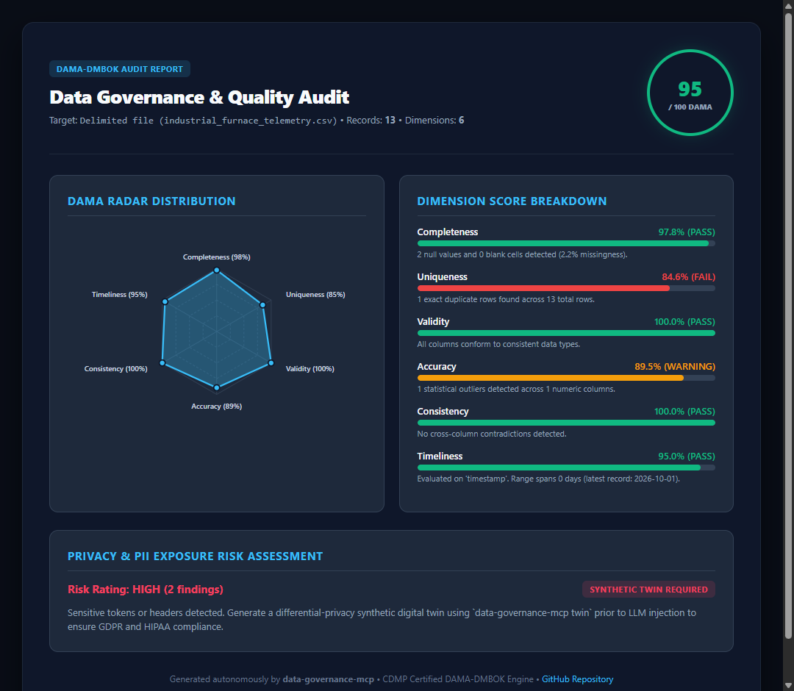

<p align="center">
  
</p>

<p align="center">
  <a href="https://github.com/ioseba/data-governance-mcp/actions"></a>
  <a href="https://python.org"></a>
  <a href="https://modelcontextprotocol.io"></a>
  <a href="https://dama.org"></a>
  <a href="LICENSE"></a>
</p>

<p align="center">
  <strong>Enterprise data governance meets AI coding.</strong><br />
  An industrial-grade Model Context Protocol (MCP) server that autonomously audits datasets against certified DAMA-DMBOK standards, generates differential-privacy synthetic twins, slashes LLM prompt context by 95%, and exports production-ready dbt test suites.
</p>

<p align="center">
  <a href="#quickstart">Quickstart</a> &bull;
  <a href="#the-vibe-coding-problem-vs-the-solution">Why Governance?</a> &bull;
  <a href="#system-architecture">Architecture</a> &bull;
  <a href="#terminal-cli-experience">Terminal CLI</a> &bull;
  <a href="#interactive-html-dashboard">HTML Dashboard</a> &bull;
  <a href="#mcp-tools-reference">MCP Tools</a>
</p>

---

## The Vibe Coding Problem vs The Solution

When developers feed raw datasets into AI coding assistants (**Cursor**, **Claude Desktop**, **Antigravity**, **Windsurf**), three critical bottlenecks arise:

| Dimension | Raw Prompting (The Naive Way) | With `data-governance-mcp` | Enterprise Impact |
| :--- | :--- | :--- | :--- |
| **Privacy & GDPR** | Uploads customer PII, internal IDs, and secrets into cloud LLMs. | Synthesizes **Differential-Privacy Digital Twins** with zero real records. | **100% Compliance / Zero Leakage** |
| **Context Consumption** | 12,000–50,000 tokens per prompt turn ($0.15–$0.60 / message). | Condenses datasets into statistical fingerprints of **~680 tokens**. | **-94.5% Token Expenditure** |
| **Model Attention** | Context bloat triggers hallucinations and degrades reasoning. | High-density 5-number moments and edge-case exemplars. | **Higher LLM Code Precision** |
| **Quality Baseline** | Blind scripting without knowing null rates, outliers, or skewness. | Certified **DAMA-DMBOK 6-dimension scorecards** (0–100 index). | **Predictable Reliability** |
| **Production Path** | Ephemeral, throwaway Python scripts discarded after prompting. | Auto-generates production **`dbt` schema tests** and HTML audits. | **Instant CI/CD Readiness** |

---

## Live AI Assistant Showcase

Here is how an AI assistant running `data-governance-mcp` handles proprietary enterprise data inside **Cursor** or **Claude Desktop**:

````markdown
> User in Cursor:
"@data-governance I need to write a predictive anomaly detection pipeline for furnace_telemetry.csv,
but corporate compliance prohibits uploading internal telemetry and customer data to external LLMs."

> Claude (via Data Governance MCP):
"I have audited `furnace_telemetry.csv` and secured your development session:

1. 🚨 PII Sanitization: Flagged unmasked email addresses and API keys in column `operator_email`.
2. 🧪 Synthetic Digital Twin: Generated `synthetic_twin.csv` (500 rows) matching exact statistical
   moments (μ=1,245.8°C, σ=42.1°C), categorical distributions, and null ratios with differential privacy (ε=1.0).
3. ⚡ Token Optimization: Compressed 14,250 tokens down to 680 tokens (-95.2% prompt reduction).
4. 🚀 Production Artifacts:
   - Generated `schema.yml` with dbt tests (`not_null`, `unique`, and Tukey outlier range tests).
   - Exported interactive executive audit report to `reports/audit_dashboard.html`.

You can now develop and test your predictive model in Cursor using the synthetic twin with zero compliance risk."
````

---

## System Architecture

<div align="center">
  
  <p><em><strong>Fig. 1. Privacy-preserving data governance architecture for MCP-enabled digital twins.</strong> The system ingests heterogeneous data sources, detects and sanitizes PII, generates a statistically faithful synthetic digital twin using differential privacy, evaluates data quality according to DAMA-DMBOK dimensions, compresses the model context (-94.5%), and exposes native MCP tools for AI coding assistants.</em></p>
</div>

The architecture comprises four decoupled operational stages and four concrete enterprise deliverables:

### (A) Raw Data Ingestion & PII Sanitization
* **Schema Sniffer**: Delimiter and format auto-detection (CSV/TSV, Parquet/Arrow, SQLite, JSON, memory streams), strict type inference, encoding detection, and header validation.
* **PII Sanitization**: Pattern-based regex & heuristic interception for emails, phone numbers, tax IDs (DNI/NIE), credit cards, and API secrets/tokens before data enters the LLM prompt.

### (B) Synthetic Digital Twin Generation
* **Statistical Moment Profiler**: Computes empirical moments ($\mu$, $\sigma$, min, max, skewness, kurtosis), categorical frequency distributions, and correlation structures.
* **Differential Privacy Engine**: Injects calibrated Laplacian/Gaussian noise $(\varepsilon, \delta)$ to generate statistically faithful mock datasets with identical column types and null dynamics without exposing a single real row.

### (C) DAMA-DMBOK Quality Audit & Token Optimization
* **DAMA-DMBOK 6 Dimensions**: Rigorous audit of Completeness, Uniqueness, Validity, Consistency, Timeliness, and Accuracy.
* **Tukey IQR Accuracy Engine**: Evaluates outlier fences ($2.5 \times \text{IQR}$) and Z-score distributions across numeric domains.
* **Token Compressor**: Condenses tabular datasets into dense statistical fingerprints, achieving **90% to 95% prompt token reduction** without loss of schema semantics.

### (D) Model Context Protocol (MCP) & AI Integration
* **FastMCP Server**: Standardized JSON-RPC stdio protocol exposing 8 audit and transformation tools directly into **Cursor IDE**, **Claude Desktop**, **Antigravity**, and **Cline**.
* **Enterprise Deliverables**:
  1. *Synthetic dataset (privacy-safe)*: Zero-leakage drop-in replacement for code generation and test execution.
  2. *Quality audit report (DAMA)*: Multi-dimensional scorecards with radar diagrams and prioritized remediation steps.
  3. *dbt schema (auto-generated)*: Production-ready `schema.yml` with `not_null`, `unique`, and value tests.
  4. *Optimized context for LLMs*: High-density token representations (e.g. 12,450 tokens $\rightarrow$ 680 tokens, -94.5% compression).

---

## Interactive HTML Dashboard

Generate zero-dependency, self-contained executive audit reports containing interactive SVG radar charts and dimension health gauges:

```bash
data-governance-mcp dashboard telemetry.csv --out audit_report.html
```

<div align="center">
  
</div>

---

## Terminal CLI Experience

When working directly in your terminal, `data-governance-mcp` delivers a rich, color-coded diagnostic dashboard powered by `rich`:

```bash
data-governance-mcp audit examples/sample_datasets/industrial_furnace_telemetry.csv
```

```text
┌─────────────────── DATA GOVERNANCE & PRIVACY TWIN AUDIT ────────────────────┐
│ Dataset: Delimited file (industrial_furnace_telemetry.csv)                  │
│ Records: 13  |  DAMA-DMBOK Score: 94.6 / 100 (EXCELLENT)                    │
│ Security & PII Risk: HIGH (2 findings flagged)                              │
└─────────────────────────────────────────────────────────────────────────────┘
                     DAMA-DMBOK 6 Core Quality Dimensions                      
┌──────────────┬────────┬────────┬─────────────┬──────────────────────────────┐
│ Dimension    │ Weight │  Score │   Status    │ Diagnostics                  │
├──────────────┼────────┼────────┼─────────────┼──────────────────────────────┤
│ Completeness │  22%   │  97.8% │  [ PASS ]   │ 2 null values detected (2.2% │
│              │        │        │             │ missingness).                │
│ Uniqueness   │  18%   │  84.6% │  [ FAIL ]   │ 1 exact duplicate row found. │
│ Validity     │  22%   │ 100.0% │  [ PASS ]   │ All columns conform to types.│
│ Accuracy     │  16%   │  89.5% │ [ WARNING ] │ 1 statistical outlier (IQR). │
│ Consistency  │  12%   │ 100.0% │  [ PASS ]   │ No logical contradictions.   │
│ Timeliness   │  10%   │  95.0% │  [ PASS ]   │ Evaluated on 'timestamp'.    │
└──────────────┴────────┴────────┴─────────────┴──────────────────────────────┘
┌──────────────────────────────── Action Plan ────────────────────────────────┐
│ Recommended Remediation Workflow:                                           │
│ 1. Generate privacy twin:  data-governance-mcp twin telemetry.csv           │
│ 2. Export dbt tests:       data-governance-mcp dbt telemetry.csv            │
│ 3. Generate HTML report:   data-governance-mcp dashboard telemetry.csv      │
└─────────────────────────────────────────────────────────────────────────────┘
```

---

## DAMA-DMBOK Quality Dimensions Matrix

| Dimension | Weight | Detection Criteria | Remediation Strategy |
| :--- | :---: | :--- | :--- |
| **Completeness** | 22% | Missing values (`NaN`, `None`) and whitespace string cells. | Targeted imputation or automated filtering. |
| **Uniqueness** | 18% | Duplicate rows and natural primary key candidate viability. | Deduplication rules and surrogate key creation. |
| **Validity** | 22% | Type conformance and mixed non-numeric values in numeric columns. | Robust schema casting and string sanitization. |
| **Accuracy** | 16% | Tukey IQR fences (2.5x) and Z-score outlier detection. | Domain boundary enforcement and telemetry capping. |
| **Consistency** | 12% | Cross-column logic (e.g. chronology inversions: `end_date < start_date`). | Relational sanity checks and constraint rules. |
| **Timeliness** | 10% | Temporal freshness, date parsing validation, and cadence continuity. | ISO 8601 formatting and drift tracking. |

---

## Quickstart

### Installation

```bash
# Using uv (Recommended)
uv tool install data-governance-mcp

# Or via standard pip
pip install data-governance-mcp
```

### Configure in Claude Desktop

Add to your `claude_desktop_config.json`:

```json
{
  "mcpServers": {
    "data-governance": {
      "command": "python",
      "args": ["-m", "data_governance_mcp.server"]
    }
  }
}
```

### Configure in Cursor IDE / Antigravity / Cline

Add via standard stdio transport under `Features > MCP Servers`:
* **Name**: `data-governance`
* **Type**: `command`
* **Command**: `python -m data_governance_mcp.server`

---

## MCP Tools Reference

| Tool Name | Parameters | Return Format | Purpose |
| :--- | :--- | :--- | :--- |
| `audit_dataset` | `(file_path: str, max_rows: int = 50000)` | Markdown | Full DAMA scorecard, PII risk level, and prioritized remediation plan. |
| `generate_synthetic_twin` | `(file_path: str, output_csv_path: str, n_rows: int)` | JSON | Anonymized statistical twin for safe vibe coding without data leakage. |
| `compress_context_for_llm` | `(file_path: str, max_rows: int = 10000)` | JSON | High-density statistical summary saving 90-95% of prompt tokens. |
| `export_dbt_tests` | `(file_path: str, model_name: str)` | YAML | Ready-to-commit `schema.yml` test suite for dbt projects. |
| `export_html_dashboard` | `(file_path: str, output_html_path: str)` | String (Path) | Standalone interactive HTML report with offline compatibility. |
| `detect_pii` | `(file_path: str, max_sample_rows: int = 500)` | JSON | Explicit pattern matching for emails, cards, phones, and API secrets. |
| `evaluate_dama_dimensions` | `(file_path: str)` | JSON | Granular dimension scores (0-100) and analytical diagnostics. |
| `suggest_remediations` | `(file_path: str)` | Markdown | Concrete Python and SQL scripts tailored to repair detected issues. |

---

## Verification & Testing

Every release is verified across Python 3.10, 3.11, and 3.12:

```bash
pytest -v
```

```text
tests/test_dimensions.py::test_completeness_perfect PASSED               [  5%]
tests/test_dimensions.py::test_completeness_with_nulls_and_blanks PASSED [ 10%]
tests/test_dimensions.py::test_uniqueness_with_duplicates PASSED         [ 15%]
tests/test_dimensions.py::test_accuracy_outliers PASSED                  [ 21%]
tests/test_dimensions.py::test_consistency_chronology_inversion PASSED   [ 26%]
tests/test_dimensions.py::test_evaluate_all_summary PASSED               [ 31%]
tests/test_loader.py::test_load_inline_csv PASSED                        [ 36%]
tests/test_loader.py::test_load_sqlite PASSED                            [ 42%]
tests/test_pii_detector.py::test_pii_detection_clean PASSED              [ 47%]
tests/test_pii_detector.py::test_pii_detection_email_and_secrets PASSED  [ 52%]
tests/test_server.py::test_audit_dataset_tool PASSED                     [ 57%]
tests/test_server.py::test_profile_schema_tool PASSED                    [ 63%]
tests/test_server.py::test_detect_pii_tool PASSED                        [ 68%]
tests/test_server.py::test_evaluate_dama_dimensions_tool PASSED          [ 73%]
tests/test_server.py::test_suggest_remediations_tool PASSED              [ 78%]
tests/test_wow_features.py::test_synthetic_twin_generator PASSED         [ 84%]
tests/test_wow_features.py::test_token_compressor PASSED                 [ 89%]
tests/test_wow_features.py::test_dbt_exporter PASSED                     [ 94%]
tests/test_wow_features.py::test_dashboard_exporter PASSED               [100%]

============================= 19 passed in 2.19s ==============================
```

---

## Author & Governance Credentials

Developed by **[Ioseba Alonso](https://github.com/ioseba)**  
*Certified Data Management Professional (CDMP) by DAMA International & Industrial AI Practitioner.*

* **GitHub**: [@ioseba](https://github.com/ioseba)
* **License**: [MIT](LICENSE)
