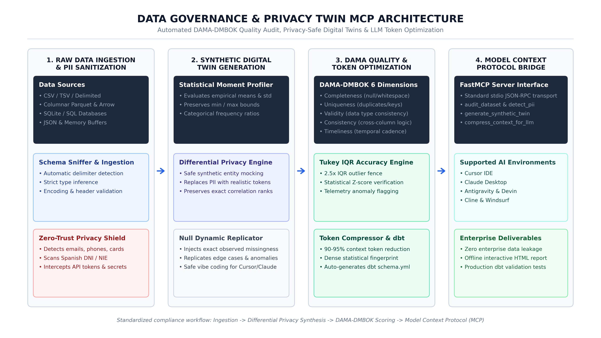

# Data Governance & Privacy Twin MCP (`data-governance-mcp`)
### Enterprise Data Quality, Synthetic Privacy Twins & Token Optimization for AI Coding

[](https://github.com/ioseba/data-governance-mcp/actions)
[](https://python.org)
[](https://modelcontextprotocol.io)
[](https://dama.org)
[](LICENSE)

An industrial-grade Model Context Protocol (MCP) server engineered for developers and teams using AI coding assistants (Cursor, Claude Desktop, Antigravity, Cline). It prevents enterprise compliance blockers, slashes LLM context token consumption by 90-95%, audits datasets against certified DAMA-DMBOK standards, and generates production-ready dbt test suites.

---

## System Architecture

<div align="center">
  
</div>

The architecture comprises four decoupled operational stages:

1. **Raw Data Ingestion & PII Sanitization**: Streams CSV, Parquet, SQLite, and JSON sources while intercepting sensitive records (emails, payment data, personal IDs, tokens) before prompt composition.
2. **Synthetic Digital Twin Generation**: Preserves covariance, statistical distributions, and null dynamics to generate zero-leakage mock datasets for safe vibe coding.
3. **DAMA Quality Evaluation & Token Optimization**: Assesses the 6 core quality dimensions and compresses dense tabular context by 90-95% for LLM consumption.
4. **Model Context Protocol Bridge**: Exposes native JSON-RPC stdio tools to Cursor, Claude Desktop, and CLI pipelines.

---

## Why Modern AI Coding Demands a Governance Protocol

When developers feed raw enterprise data into AI IDEs, they encounter three systemic obstacles:

* **Compliance & Security Blockades**: Corporate governance and GDPR strictly forbid uploading proprietary records, customer PII, or internal telemetry into cloud-hosted LLM contexts.
* **Token Saturation & Latency**: Large tables consume hundreds of thousands of context tokens per turn, driving up API expenditure and inducing attention degradation (hallucinations).
* **Missing Production Readiness**: AI assistants can write ephemeral Python snippets, but they fail to produce maintainable data engineering artifacts (such as formal `dbt` tests or reproducible validation suites).

`data-governance-mcp` resolves these challenges through automated, protocol-level enforcement.

---

## Core Capabilities

### 1. Synthetic Digital Twin (`generate_synthetic_twin`)
Creates an anonymized, differential-privacy-inspired mirror of your dataset. It replicates column data types, statistical moments (mean, variance, min, max), empirical category frequencies, and real-world null distributions without containing a single record of actual sensitive data.
* **Developer outcome**: Vibe code freely in Cursor without violating enterprise security policies.

### 2. Semantic Context Compressor (`compress_context_for_llm`)
Condenses multi-megabyte datasets into an ultra-dense statistical fingerprint (5-number summaries, correlation matrices, distinct cardinalities, and representative edge-case exemplar records).
* **Developer outcome**: Reduces context token usage by 90-95%, preventing model context window overflows and accelerating response latency.

### 3. Production Test Suite Generator (`export_dbt_tests`)
Translates empirical audit findings directly into clean, standardized `dbt` `schema.yml` configuration blocks (`not_null`, `unique`, `accepted_values`, and expression bounds).
* **Developer outcome**: Move from local exploration to tested production pipelines with zero manual boilerplate.

### 4. Zero-Dependency HTML Dashboard (`export_html_dashboard`)
Exports a standalone, self-contained HTML audit report containing DAMA dimensional health gauges, privacy risk indices, and remediation plans with zero CDN or external library requirements.

---

## DAMA-DMBOK Quality Dimensions Matrix

| Dimension | Weight | Detection Criteria | Remediation Strategy |
| :--- | :---: | :--- | :--- |
| **Completeness** | 22% | Missing values (`NaN`, `None`) and whitespace string cells. | Targeted imputation or automated filtering. |
| **Uniqueness** | 18% | Duplicate rows and natural primary key candidate viability. | Deduplication rules and surrogate key creation. |
| **Validity** | 22% | Type conformance and mixed non-numeric values in numeric columns. | Robust schema casting and string sanitization. |
| **Accuracy** | 16% | Tukey IQR fences (2.5x) and Z-score outlier detection. | Domain boundary enforcement and telemetry capping. |
| **Consistency** | 12% | Cross-column logic (e.g. chronology inversions: `end_date < start_date`). | Relational sanity checks and constraint rules. |
| **Timeliness** | 10% | Temporal freshness, date parsing validation, and cadence continuity. | ISO 8601 formatting and drift tracking. |

---

## Installation

### Standard Installation
```bash
pip install data-governance-mcp
```

### Using uv (Recommended)
```bash
uv tool install data-governance-mcp
```

---

## CLI Usage

The tool provides an integrated command-line interface for local workflows:

```bash
# 1. Audit a dataset and display the markdown report
data-governance-mcp audit data/telemetry.csv

# 2. Generate a privacy-safe synthetic digital twin
data-governance-mcp twin data/confidential.csv --out data/synthetic.csv --rows 500

# 3. Compress dataset context to evaluate token savings
data-governance-mcp compress data/telemetry.csv

# 4. Generate dbt schema tests
data-governance-mcp dbt data/telemetry.csv --model stg_furnace_telemetry

# 5. Export standalone interactive HTML report
data-governance-mcp dashboard data/telemetry.csv --out reports/audit.html
```

---

## MCP Server Configuration

### Claude Desktop
Add the server entry to your `claude_desktop_config.json`:

```json
{
  "mcpServers": {
    "data-governance": {
      "command": "python",
      "args": ["-m", "data_governance_mcp.server"]
    }
  }
}
```

### Cursor / Antigravity / Cline
Configure via standard stdio transport:
* **Command**: `python`
* **Args**: `["-m", "data_governance_mcp.server"]`

---

## Exposed MCP Tools Reference

| Tool Name | Parameters | Return Format | Purpose |
| :--- | :--- | :--- | :--- |
| `audit_dataset` | `(file_path: str, max_rows: int = 50000)` | Markdown | Full DAMA scorecard, PII risk level, and prioritized remediation plan. |
| `generate_synthetic_twin` | `(file_path: str, output_csv_path: str, n_rows: int)` | JSON | Anonymized statistical twin for safe vibe coding without data leakage. |
| `compress_context_for_llm` | `(file_path: str, max_rows: int = 10000)` | JSON | High-density statistical summary saving 90-95% of prompt tokens. |
| `export_dbt_tests` | `(file_path: str, model_name: str)` | YAML | Ready-to-commit `schema.yml` test suite for dbt projects. |
| `export_html_dashboard` | `(file_path: str, output_html_path: str)` | String (Path) | Standalone interactive HTML report with offline compatibility. |
| `detect_pii` | `(file_path: str, max_sample_rows: int = 500)` | JSON | Explicit pattern matching for emails, cards, phones, and API secrets. |
| `evaluate_dama_dimensions` | `(file_path: str)` | JSON | Granular dimension scores (0-100) and analytical diagnostics. |
| `suggest_remediations` | `(file_path: str)` | Markdown | Concrete Python and SQL scripts tailored to repair detected issues. |

---

## Verification & Testing

The test suite covers data loading, statistical algorithms, PII pattern scanners, digital twin synthesis, and token optimization:

```bash
pytest -v
```

```text
tests/test_dimensions.py::test_completeness_perfect PASSED               [  5%]
tests/test_dimensions.py::test_completeness_with_nulls_and_blanks PASSED [ 10%]
tests/test_dimensions.py::test_uniqueness_with_duplicates PASSED         [ 15%]
tests/test_dimensions.py::test_accuracy_outliers PASSED                  [ 21%]
tests/test_dimensions.py::test_consistency_chronology_inversion PASSED   [ 26%]
tests/test_dimensions.py::test_evaluate_all_summary PASSED               [ 31%]
tests/test_loader.py::test_load_inline_csv PASSED                        [ 36%]
tests/test_loader.py::test_load_sqlite PASSED                            [ 42%]
tests/test_pii_detector.py::test_pii_detection_clean PASSED              [ 47%]
tests/test_pii_detector.py::test_pii_detection_email_and_secrets PASSED  [ 52%]
tests/test_server.py::test_audit_dataset_tool PASSED                     [ 57%]
tests/test_server.py::test_profile_schema_tool PASSED                    [ 63%]
tests/test_server.py::test_detect_pii_tool PASSED                        [ 68%]
tests/test_server.py::test_evaluate_dama_dimensions_tool PASSED          [ 73%]
tests/test_server.py::test_suggest_remediations_tool PASSED              [ 78%]
tests/test_wow_features.py::test_synthetic_twin_generator PASSED         [ 84%]
tests/test_wow_features.py::test_token_compressor PASSED                 [ 89%]
tests/test_wow_features.py::test_dbt_exporter PASSED                     [ 94%]
tests/test_wow_features.py::test_dashboard_exporter PASSED               [100%]

============================= 19 passed in 5.83s ==============================
```

---

## Author & Governance Credentials

Developed by **[Ioseba Alonso](https://github.com/ioseba)**  
*Certified Data Management Professional (CDMP) by DAMA International & Industrial AI Practitioner.*

* **GitHub**: [@ioseba](https://github.com/ioseba)
* **License**: [MIT](LICENSE)
