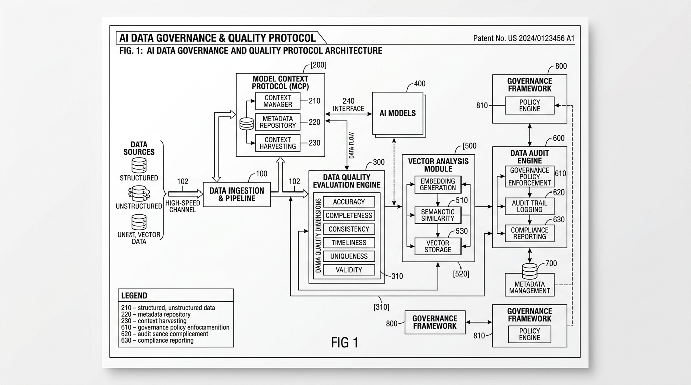

<div align="center">

# 🛡️ Data Governance MCP (`data-governance-mcp`)
### *Autonomous Data Quality Audit & PII Compliance Protocol for AI Agents*

[](https://github.com/ioseba/data-governance-mcp/actions)
[](https://python.org)
[](https://modelcontextprotocol.io)
[](https://dama.org)
[](LICENSE)

<br/>

**A production-ready [Model Context Protocol (MCP)](https://modelcontextprotocol.io) server that empowers LLM agents (Claude Desktop, Cursor, Antigravity, Cline) to autonomously inspect, validate, and remediate datasets using certified DAMA-DMBOK data governance standards.**

</div>

---

## 🏛️ Architectural Blueprint & Technical Specification

The following schematic outlines the architectural dataflow between the ingestion pipeline, the DAMA data quality evaluation engine, the PII privacy filter, and the host AI agent via MCP:

<div align="center">
  
  <p><em>FIG. 1: Formal Block Diagram & Operational Dataflow of the AI Data Governance & Quality Protocol (Patent-Style Schematic Specification).</em></p>
</div>

---

## 💡 The Problem: Why Agents Need Data Governance

Modern AI agents are increasingly entrusted with tabular reasoning, SQL synthesis, and industrial telemetry analytics. However:

1. **Garbage In, Hallucination Out**: Unsanitized nulls, statistical outliers, and duplicate records mislead agent reasoning and distort calculations.
2. **PII & Credential Leakage**: Feeding raw CSVs or databases directly into external LLM prompts creates immediate GDPR, HIPAA, and security liabilities.
3. **Monolithic Tooling Friction**: Legacy enterprise data governance tools (Collibra, Informatica) are too heavy for agile agent tool-calling, while basic libraries lack standardized governance scoring.

**`data-governance-mcp` bridges this gap.** In a single tool call, your AI assistant evaluates datasets against the **6 Core DAMA Dimensions**, flags confidential data, and generates concrete remediation scripts.

---

## 📐 The 6 Core DAMA-DMBOK Quality Dimensions

| Dimension | Description | Diagnostic Rules |
| :--- | :--- | :--- |
| **1. Completeness** | Absence of missing or empty data. | Detects explicit `NaN`/`None` values and blank whitespace string cells. |
| **2. Uniqueness** | Zero unexpected duplicate records. | Identifies duplicate rows and flags viable primary key candidates. |
| **3. Validity** | Conformance to expected formats and types. | Detects non-numeric strings in numeric columns and type-casting failures. |
| **4. Accuracy** | Plausibility of numerical values. | Tukey's IQR (2.5 fence) and Z-score outlier detection for physical anomalies. |
| **5. Consistency** | Logical coherence across related fields. | Cross-field sanity checks (e.g. `end_date >= start_date`, status inversions). |
| **6. Timeliness** | Freshness and cadence of records. | Validates timestamp column continuity and timespan range. |

---

## ⚡ Quickstart

### 1. Installation

```bash
# Using pip
pip install data-governance-mcp

# Or using uv (recommended)
uv tool install data-governance-mcp
```

### 2. Standalone CLI Usage

You can test and audit datasets directly from your terminal:

```bash
# Generate executive Markdown audit report
data-governance-mcp audit sample_data.csv

# Output machine-readable JSON
data-governance-mcp audit sample_data.csv --json
```

---

## 🔌 AI Agent Integration (MCP Configuration)

### Claude Desktop
Add this to your `claude_desktop_config.json`:

```json
{
  "mcpServers": {
    "data-governance": {
      "command": "python",
      "args": ["-m", "data_governance_mcp.server"]
    }
  }
}
```

### Cursor / Antigravity / Cline
Configure via standard stdio transport:
* **Command**: `python`
* **Args**: `["-m", "data_governance_mcp.server"]`

---

## 🧰 Exposed MCP Tools

When registered, AI models gain direct access to 5 high-impact governance tools:

| MCP Tool | Signature | Purpose |
| :--- | :--- | :--- |
| `audit_dataset` | `(file_path: str, max_rows: int = 50000)` | Generates complete executive Markdown audit with DAMA score, PII scan & action plan. |
| `profile_schema` | `(file_path: str, max_rows: int = 10000)` | Returns column types, null percentages, distinct counts, and sample values in JSON. |
| `detect_pii` | `(file_path: str, max_sample_rows: int = 500)` | Scans for emails, credit cards, phones, DNI/NIE, API secrets, and sensitive headers. |
| `evaluate_dama_dimensions` | `(file_path: str)` | Returns raw numerical metrics (0-100) and diagnostics for all 6 DAMA dimensions. |
| `suggest_remediations` | `(file_path: str)` | Generates ready-to-run Python/SQL snippets to clean and sanitize flagged issues. |

---

## 📊 Sample Output Walkthrough

Here is an actual report generated by `data-governance-mcp` inspecting an industrial telemetry batch:

```markdown
# 🛡️ Data Governance & Quality Audit Report
> Target Dataset: `industrial_furnace_telemetry.csv` | Records: `13` | Columns: `7`

## 📊 Executive Summary
| Metric | Value | Compliance Status |
| :--- | :--- | :--- |
| DAMA Overall Quality Index | 94.6 / 100 | 🟢 EXCELLENT |
| Privacy & PII Exposure Risk | HIGH | 🚨 2 findings |
| Critical Blockers | 1 | ❌ Remediation Required |

## 📐 DAMA-DMBOK Quality Dimensions Breakdown
| Dimension | Score | Status | Key Diagnostic Finding |
| :--- | :---: | :---: | :--- |
| Completeness | 97.8% | 🟢 PASS | 2 null values detected (2.2% missingness). |
| Uniqueness | 84.6% | 🔴 FAIL | 1 exact duplicate row found across 13 total rows. |
| Validity | 100.0% | 🟢 PASS | All columns conform to consistent data types. |
| Accuracy | 89.5% | 🟡 WARNING | 1 statistical outlier detected in temperature sensors. |
| Consistency | 100.0% | 🟢 PASS | No cross-column contradictions detected. |
| Timeliness | 95.0% | 🟢 PASS | Evaluated on 'timestamp'. Range spans regular intervals. |

## 🚨 Sensitive Data & Privacy Risks (PII)
- Column `operator_email`:
  - ⚠️ Header Alert: Column name matches sensitive keyword 'email'.
  - 🔴 Pattern Match: Found 8 instances of EMAIL (66.7% of sample)

> [!CAUTION]
> Data contains high-risk PII/credentials (HIGH). Do NOT ingest into untrusted external LLM prompts without tokenization or hashing.

## 🛠️ Actionable Remediation Plan
1. Deduplicate 1 identical rows using `df.drop_duplicates()`.
2. Impute missing values in sensor readings using domain interpolations.
3. Apply tokenization/hashing to `operator_email` before LLM processing.
```

---

## 🧪 Testing

The test suite covers data loaders, outlier detection algorithms, PII pattern matchers, and MCP tool endpoints:

```bash
pytest -v
```

```text
tests/test_dimensions.py::test_completeness_perfect PASSED               [  6%]
tests/test_dimensions.py::test_completeness_with_nulls_and_blanks PASSED [ 13%]
tests/test_dimensions.py::test_uniqueness_with_duplicates PASSED         [ 20%]
tests/test_dimensions.py::test_accuracy_outliers PASSED                  [ 26%]
tests/test_dimensions.py::test_consistency_chronology_inversion PASSED   [ 33%]
tests/test_dimensions.py::test_evaluate_all_summary PASSED               [ 40%]
tests/test_loader.py::test_load_inline_csv PASSED                        [ 46%]
tests/test_loader.py::test_load_sqlite PASSED                            [ 53%]
tests/test_pii_detector.py::test_pii_detection_clean PASSED              [ 60%]
tests/test_pii_detector.py::test_pii_detection_email_and_secrets PASSED  [ 66%]
tests/test_server.py::test_audit_dataset_tool PASSED                     [ 73%]
tests/test_server.py::test_profile_schema_tool PASSED                    [ 80%]
tests/test_server.py::test_detect_pii_tool PASSED                        [ 86%]
tests/test_server.py::test_evaluate_dama_dimensions_tool PASSED          [ 93%]
tests/test_server.py::test_suggest_remediations_tool PASSED              [100%]

============================= 15 passed in 3.43s ==============================
```

---

## 👤 Author & Governance Alignment

Engineered by **[Ioseba Alonso](https://github.com/ioseba)**  
*Certified Data Management Professional (CDMP) by DAMA International & Industrial AI Practitioner.*

* **GitHub**: [@ioseba](https://github.com/ioseba)
* **License**: [MIT](LICENSE)
